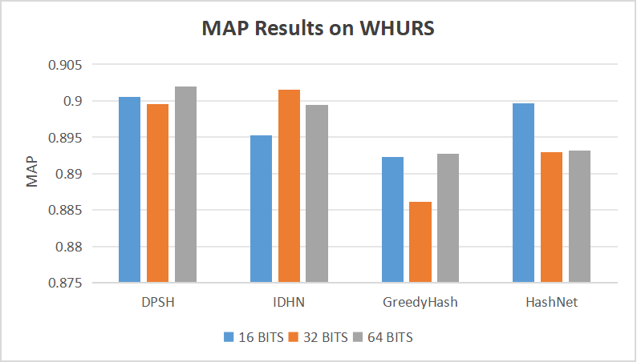
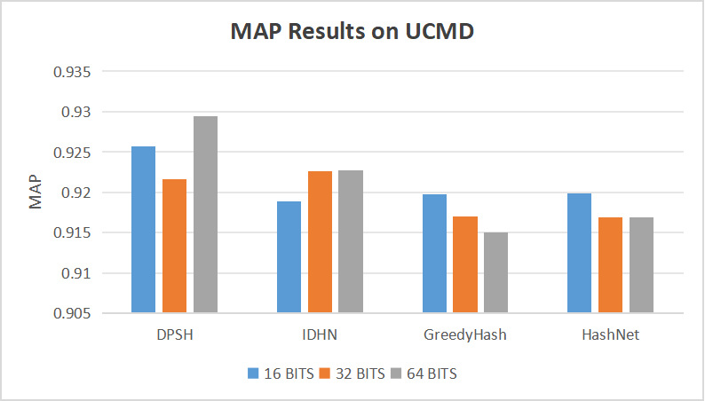
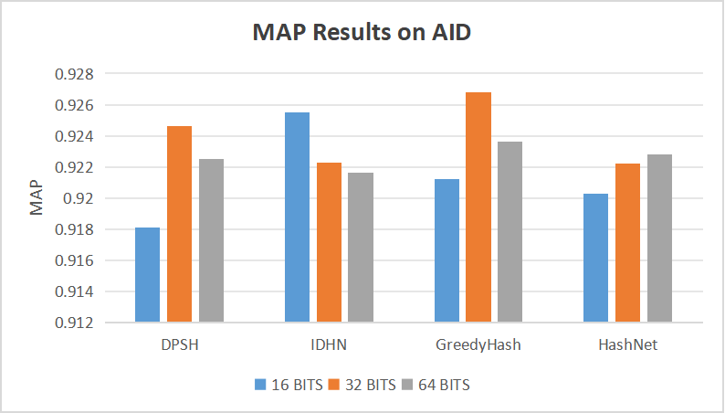

Deep Hashing Models for Image Retrieval on Remote Sensing Datasets

This repository provides the implementation of four state-of-the-art deep hashing models for image retrieval,
specifically designed for three remote sensing datasets.

## Features
- Implementation of **four state-of-the-art deep hashing models**.
- Support for **three remote sensing datasets**:
  - **UC Merced Land Use Dataset (UCMD)**
  - **WHU-RS Dataset**
  - **Aerial Image Dataset (AID)**
- Comprehensive evaluation of hashing-based image retrieval performance.
- Customizable parameters for training and testing.

## Evaluation Results
### 16 BITS
| Model       | WHU-RS |  UCMD  | AID    |
|-------------|--------|--------|--------|
| DPSH        | 0.9005 | 0.9257 | 0.9181 |
| IDHN        | 0.8953 | 0.9189 | 0.9255 |
| GreedyHash  | 0.8923 | 0.9197 | 0.9212 |
| HashNet     | 0.8997 | 0.9199 | 0.9203 |

### 32 BITS
| Model       | WHU-RS |  UCMD  | AID    |
|-------------|--------|--------|--------|
| DPSH        | 0.8995 | 0.9216 | 0.9246 |
| IDHN        | 0.9015 | 0.9226 | 0.9223 |
| GreedyHash  | 0.8861 | 0.9170 | 0.9268 |
| HashNet     | 0.8929 | 0.9169 | 0.9222 |

### 64 BITS
| Model       | WHU-RS |  UCMD  | AID    |
|-------------|--------|--------|--------|
| DPSH        | 0.9020 | 0.9294 | 0.9225 |
| IDHN        | 0.8994 | 0.9227 | 0.9216 |
| GreedyHash  | 0.8927 | 0.9150 | 0.9236 |
| HashNet     | 0.8932 | 0.9169 | 0.9228 |

